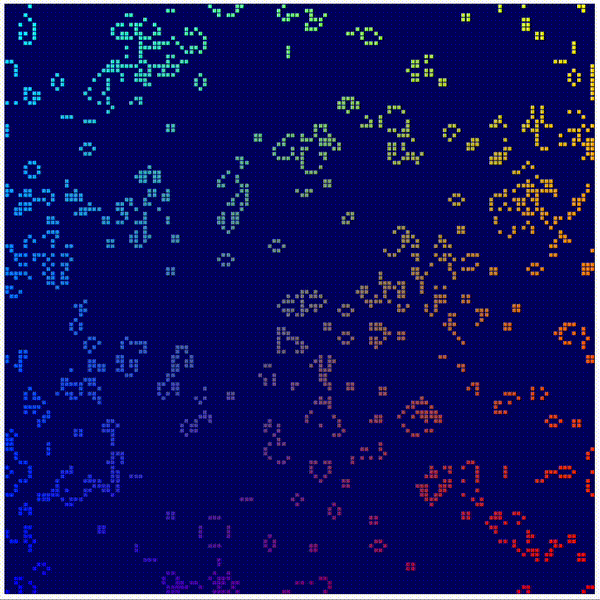

# Conway's Game of Life using WebGPU

This is a simple implementation of Conway's Game of Life using WebGPU. It is based on the brilliant [WebGPU tutorial by Google](https://codelabs.developers.google.com/your-first-webgpu-app#0).

To use this, you need a browser that supports WebGPU. Currently, this means you need to use Chrome Canary with the `--enable-unsafe-webgpu` flag. You can also use Firefox Nightly with the `dom.webgpu.enabled` flag set to `true`.

Just open `index.html` in your browser and you should see the game of life running.

Conway's Game of Life is a cellular automaton devised by the British mathematician John Horton Conway in 1970. It is a zero-player game, meaning that its evolution is determined by its initial state, requiring no further input. One interacts with the Game of Life by creating an initial configuration and observing how it evolves.
